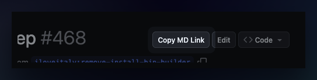

# webext-github-copy-md-link

Browser extension (Chrome & Firefox) that adds a **Copy MD Link** button to GitHub
pull request pages. Clicking it copies the PR link as Markdown to your clipboard.



**Format:**

```
[<repo>/PR#<number> - <title>](<url>)
```

**Example output:**

```
[webext-github-copy-md-link/PR#123 - Some pull request](https://github.com/half0wl/webext-github-copy-md-link/pull/123)
```

## Install

### Firefox

1. Download the latest `.xpi` from [Releases](../../releases/latest)
2. Open the file in Firefox (drag into browser or `File` → `Open File`)

### Chrome

1. Download or clone this repo
2. Go to `chrome://extensions`
3. Enable **Developer Mode**
4. Click **Load unpacked** and select the folder

## License

[MIT License - Copyright (c) 2026 Ray Chen <meow@ray.cat>](LICENSE)
